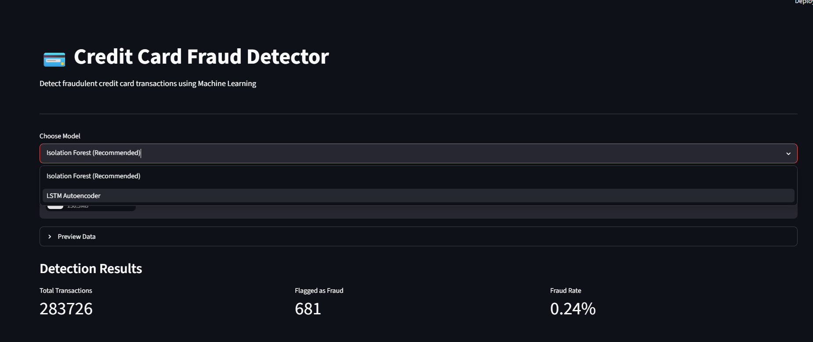
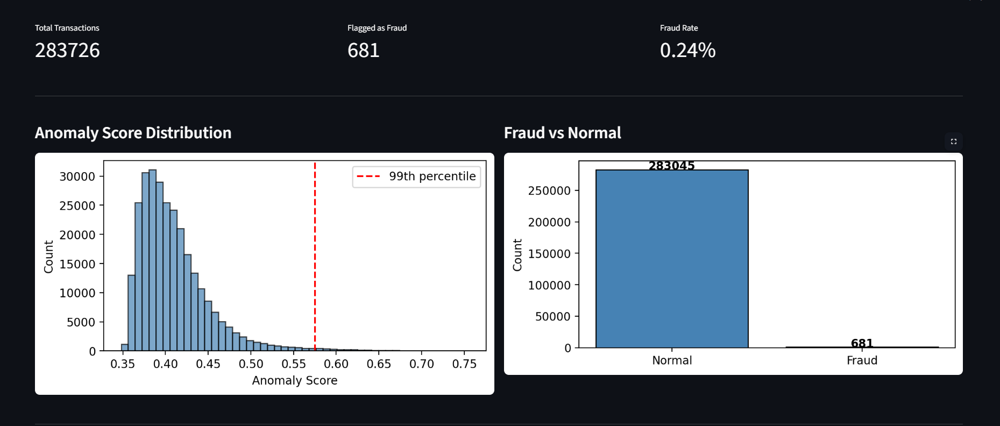
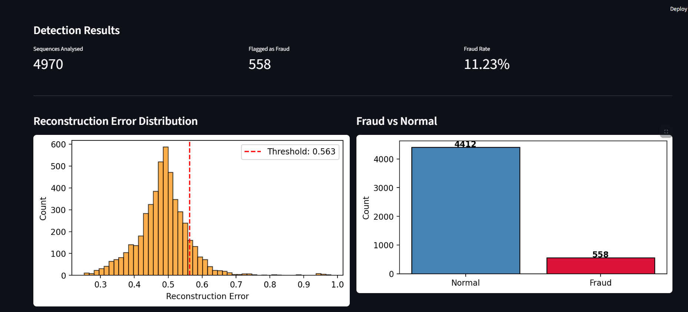
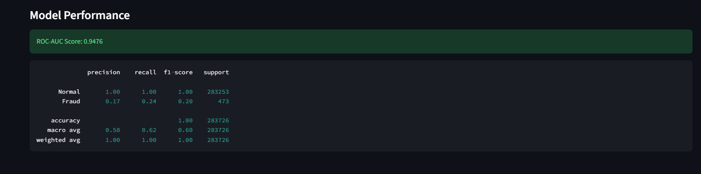

# 💳 Credit Card Fraud Detection System


A machine learning system that detects fraudulent credit card transactions using LSTM Autoencoder and Isolation Forest, deployed as an interactive Streamlit dashboard.

---

## Dashboard Screenshots

### Main Dashboard


### Isolation Forest Results


### LSTM Autoencoder Results


### Model Performance


---

## Why Fraud Detection Matters

Credit card fraud costs the global economy over $30 billion annually. Traditional rule-based systems miss novel fraud patterns. This project explores unsupervised ML approaches that can detect unusual patterns without needing labelled fraud examples at training time.

---

## Project Overview

This project tackles the real-world problem of credit card fraud detection using unsupervised anomaly detection. The system learns what normal transactions look like and flags anything unusual as potential fraud. Two models are compared — LSTM Autoencoder and Isolation Forest — with a full analysis of why one outperforms the other on this dataset.

---

## Dataset

- **Source**: [Kaggle Credit Card Fraud Detection](https://www.kaggle.com/datasets/mlg-ulb/creditcardfraud)
- **Size**: 284,807 transactions
- **Fraud rate**: 0.17% (highly imbalanced)
- **Features**: 30 features (Time, Amount, V1-V28)

---

## Results

| Model | ROC-AUC | Fraud Recall |
|-------|---------|--------------|
| LSTM Autoencoder | 0.78 | 26% |
| Isolation Forest | 0.95 | 24% |

**Key Finding**: Isolation Forest outperforms LSTM because transactions in this dataset are from different cardholders mixed together — not truly sequential. This shows why model selection based on data characteristics is critical.

---

## Project Structure

```
anomaly_detector/
├── data/
│   ├── creditcard.csv             
│   └── creditcard_cleaned.csv     
├── notebooks/
│   └── eda.ipynb                  
├── screenshots/
│   ├── dashboard.png
│   ├── isolation_forest.png
│   ├── isolation_forest_model_score.png
│   ├── lstm_autoencoder.png
│   └── lstm_autoencoder_model_score.png
├── src/
│   ├── preprocess.py              
│   ├── model.py                   
│   ├── train.py                   
│   ├── detect.py                  
│   └── baseline.py                
├── app.py                         
├── requirements.txt
└── README.md
```

---

## Tech Stack

- Python 3.12
- TensorFlow / Keras
- Scikit-learn
- Pandas, NumPy
- Streamlit
- Jupyter Notebook

---

## How to Run

**1. Clone the repository**
```bash
git clone https://github.com/shrutinag18/credit-card-fraud-detection.git
cd credit-card-fraud-detection
```

**2. Create virtual environment**
```bash
py -3.12 -m venv venv
.\venv\Scripts\Activate.ps1
pip install -r requirements.txt
```

**3. Download dataset**

Download from [Kaggle](https://www.kaggle.com/datasets/mlg-ulb/creditcardfraud) and place `creditcard.csv` in the `data/` folder.

**4. Run EDA notebook**
```bash
jupyter notebook
```
Open `notebooks/eda.ipynb` and run all cells to generate `creditcard_cleaned.csv`.

**5. Train models**
```bash
python -m src.train
python -m src.baseline
```

**6. Launch dashboard**
```bash
streamlit run app.py
```

---

## How to Interpret Results

- **Anomaly Score**: Higher score means more suspicious transaction
- **Threshold**: Transactions above this score are flagged as fraud
- **ROC-AUC**: Measures model ability to distinguish fraud from normal
  - 0.5 = random guessing
  - 1.0 = perfect detection
  - Our Isolation Forest = 0.95

---

## Challenges Faced

- **Severe class imbalance**: Only 0.17% fraud — solved by training only on normal data using unsupervised approach
- **Wrong sequential assumption**: LSTM assumes transactions are sequential across cardholders which is incorrect — discovered through model comparison
- **Threshold tuning**: Experimented with different standard deviation multipliers to balance precision and recall

---

## Future Improvements

- Implement SMOTE for handling class imbalance
- Try Autoencoder with attention mechanism
- Add real-time transaction streaming simulation
- Deploy on cloud (AWS/GCP free tier)
- Add email alerts when fraud is detected

---

## What I Learned

- Unsupervised anomaly detection for imbalanced datasets
- Why model selection matters — LSTM is not always the best choice
- End to end ML pipeline from raw data to deployed dashboard
- Importance of baseline comparison in ML projects
- Real world data is messy and assumptions must be validated